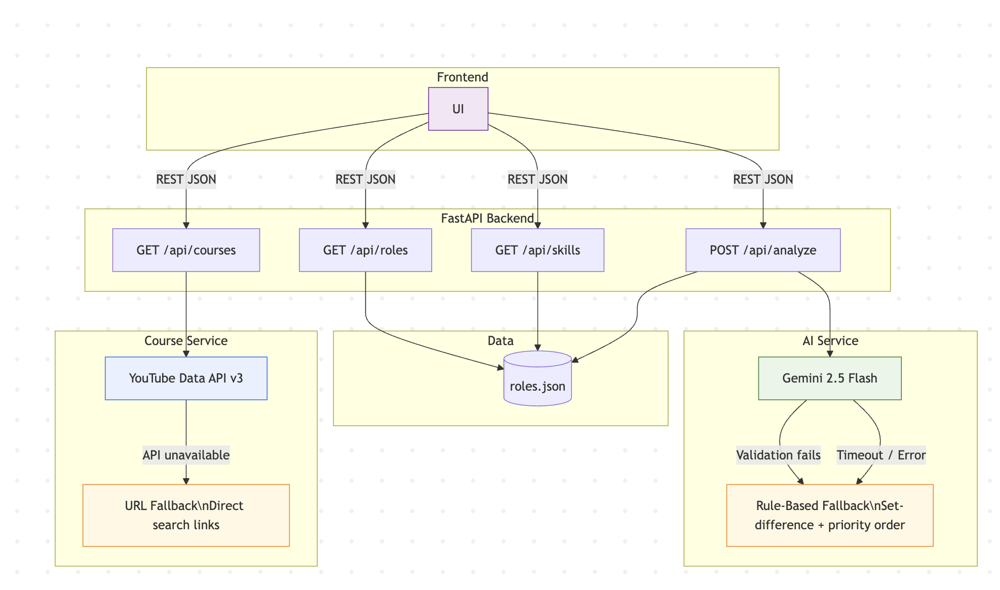

# Skill-Bridge Career Navigator — Design Document

## Problem

Students and early-career professionals cannot easily identify what skills they need to reach their target role. They browse job boards, read certification sites, and ask peers — but none of these produce a prioritized, actionable output. The goal is a tool that takes a user's current skills and a target role, runs a gap analysis, and returns a prioritized learning roadmap with real resources.

## Design Options

Three end-to-end designs were considered. Each represents a different combination of product framing, input method, AI usage, and resource delivery.

### Option A — Resume-Driven Discovery Platform

The user uploads or pastes their resume. The AI extracts skills, matches them against a broad database of roles, ranks the top matching roles, and generates a learning plan for the best match. Resources are AI-generated recommendations (course names and descriptions).

Pros: Lowest friction for the user — paste a resume and get everything. Covers the "I don't know what I want" use case. Feels like a complete product.

Cons: Requires two AI calls minimum (extraction + analysis), which doubles the failure surface. If extraction is wrong, everything downstream is wrong, and the user has no way to know. Resume parsing quality varies wildly by format. Role matching output is ambiguous — "73% match to Cloud Engineer" doesn't tell the user what to do. AI-generated course recommendations will hallucinate names and URLs that don't exist. No viable fallback — every step depends on AI. Testing is extremely difficult because inputs and outputs are both unstructured.

### Option B — Structured Input with AI Analysis and Real Resources

The user enters skills via autocomplete tags and selects a target role and level from a predefined list. The AI compares the user's skills against the role's requirements and returns the top 5 skills to develop with reasons. YouTube API provides real video resources for each skill, tailored by level. A rule-based fallback handles AI failures using set-difference against the role's required skills.

Pros: Tight input-output-action loop — the user does something specific, gets a specific result, and has a specific next step. The AI has a well-defined task (compare and prioritize) that produces verifiable output. The fallback works because predefined roles guarantee structured data to compare against. YouTube API returns real, current links — no hallucinated resources. Testing is deterministic — inputs are bounded, outputs are schema-validated. Every component has a fallback: AI falls to rule-based, YouTube API falls to search URLs.

Cons: Requires the user to already know what role they want. Doesn't parse resumes, which the rubric mentions. Predefined roles limit the tool to what's in the data file. The fallback is less nuanced than AI — no synonym detection, no partial matching.

### Option C — Free-Text Conversational Advisor

The user describes their background and goals in natural language. The AI acts as a career advisor, asking follow-up questions and generating a personalized plan through multi-turn conversation. Resources are AI-generated.

Pros: Most natural interaction model. Handles ambiguity well — the AI can ask clarifying questions. Flexible enough to handle any career question.

Cons: No fallback path at all — the entire product is the AI. Output is non-deterministic and untestable. Multi-turn conversation is hard to demo in 5 minutes. Resources are hallucinated. No structured data means no way to validate recommendations. The rubric explicitly requires a fallback when AI is unavailable — this option cannot satisfy that requirement.

### Decision: Option B

Option B was chosen because it satisfies every rubric requirement while maintaining a viable fallback path. The AI has a well-defined task with verifiable output. The predefined roles guarantee the fallback always has structured data to work with. Real YouTube links eliminate hallucination. The tradeoff — no resume parsing, predefined roles only — is acceptable for an MVP and addressable in v2.

The resume parsing gap from Option A is mitigated by designing the skill input as a tag system that a future resume parser could feed into. The user would paste a resume, AI extracts skills into the tags, the user reviews and edits, then the existing analysis flow runs unchanged. This keeps resume parsing as an additive convenience layer rather than a structural dependency.

## Architecture

## Core Flow

The user enters skills via autocomplete tags. The master skill list is derived from all roles and levels in the data — skills selected from this list are guaranteed to match in both the AI and fallback paths. Custom skills not in the list are accepted and passed to the AI, but the fallback can only operate on exact matches.

The user selects a role from a filterable list (12 career areas from Palo Alto Networks' job board) and a target level (Junior, Mid, Senior). Roles are predefined rather than free-text because the fallback requires structured skill data — a free-text role like "backend engineer at a startup" provides nothing for set-difference analysis.

The analysis sends the user's skills, role data, target level, and previous level's skills to Gemini with a structured prompt. The AI returns 5 prioritized skills with reasons. If the AI call fails, returns invalid JSON, fails request ID verification, or fails schema validation, the system falls to rule-based analysis using set-difference against the role's required skills (ordered by importance in the data).

For each recommended skill, the YouTube API returns 3 videos. Search queries vary by level (junior gets tutorials, mid gets deep dives, senior gets conference talks and leadership discussions) and by skill type (technical vs leadership skills use different query templates).

## Prompt Injection Defense

User input flows into AI prompts, carrying the same injection risk as user input in SQL queries. Prompt injection is fundamentally unsolved — there is no LLM equivalent of parameterized queries. The system is designed to detect and contain compromised responses rather than prevent injection entirely.

Layer 1 is structural prevention. The prompt separates system instructions from user data with explicit trust labels. The AI is instructed to ignore instructions within the user data section.

Layer 2 is detection. A server-generated UUID is included in the prompt and must be echoed back in the response. The UUID is generated per-request and never exposed to the client. An attacker cannot predict it even with access to the source code.

Layer 3 is containment. The response must contain the matching request_id, exactly 5 skills, and each skill must have a name and reason string. Any violation triggers the fallback.

If any layer fails, the rule-based result is returned. A compromised AI response never reaches the user. This mirrors a defense-in-depth approach: prevention, detection, containment — a breach at one layer is caught by the next.

## Fallback Behavior

The fallback activates on any AI failure: timeout, rate limit, network error, invalid JSON, request ID mismatch, or schema violation. It computes set-difference between the user's skills (lowercased) and the role's required skills (in array order, which represents importance). It returns the first 5 missing skills with mechanical reasons.

What degrades: synonym recognition ("JS" vs "JavaScript"), partial match detection ("Docker" vs "Container Orchestration"), contextual prioritization, custom skill recognition, personalized reasons, certification recommendations, and level progression awareness. What does not degrade: the user always receives a usable, prioritized list of skills to develop. The fallback is conservative but correct.

## Data

13 roles across 12 career areas, mapped to Palo Alto Networks' actual job board categories: Software Engineering, Software Engineering Automation/Test, Software Machine Learning Engineering, Site Reliability Engineering, DevOps Engineering, IT Software Engineer, Systems Engineering, Systems Engineering - Specialist, Cybersecurity Consulting, Product Management, Professional Services Engineering, and Technical Support.

Each role has three levels. Required skills are stored as flat string arrays ordered by importance. Nice-to-have skills are included for AI context. Skills and progression patterns are synthesized from real Palo Alto Networks job postings — no single posting was copied directly, but the data is grounded in what the company actually hires for.

## Testing

Happy path: submit known skills against a known role with mocked AI, verify 5 skills returned with correct structure and used_fallback false.

AI failure: mock Gemini to raise ConnectionError, verify fallback activates, returns skills from role data in priority order, used_fallback true, user's existing skills excluded from results.

Input validation: empty skills returns 422, invalid role ID returns 404, role endpoints return data, category filtering works.

## Future Work

In priority order: (1) resume parsing as a convenience layer feeding into the existing tag input, (2) skill synonym normalization for the fallback, (3) user feedback on recommendations.